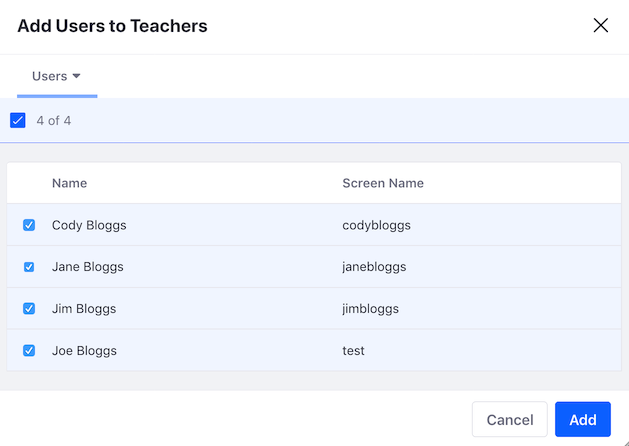
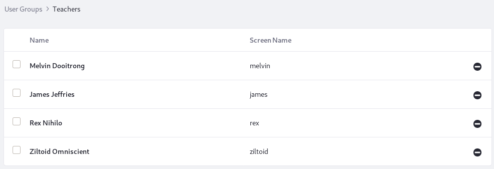

# Creating and Managing User Groups

A User Group is a list of Users created for a specific purpose. User Groups can be created across the hierarchical boundaries of [Organizations](../organizations/understanding-organizations.md). For example, an administrator could create a Teachers User Group for adding all members to multiple Sites, assign them all to a [Regular Role](https://help.liferay.com/hc/en-us/articles/360028819032-Roles-and-Permissions), and create a common set of profile pages for all teachers in the User Group. User Groups are integrated with Roles, Sites, Site Templates, and permissions. This flexibility means that there are many different use cases for User Groups. The articles in this section show you how to work with User Groups to serve the most common use cases.

| Use Case                     | Description                                    |
| ---------------------------- | -----------------------------------------------|
| Manage Site membership       | Grant Site membership to all Users in a User Group. Using the previous example, the Teachers User Group could be added as a member of the Sites *University Employees* and *Students and Teachers Collaboration*. All users in that User Group would become members of those Sites. |
| Manage Users' personal pages | Provide predefined public or private pages to the users in the User Group. For example, the Teachers User Group could be created to ensure the home page on all teachers' personal Sites has the same layout and applications. |
| Collect permissions          |Assign Roles and permissions to a group of Users that don't share an organization. For example, in a university's portal, a User Group could be created to group all teachers independently of their departments (organization). This would make it easier to assign one or several Roles at once to all the teachers. |

## Creating a User Group

To create a User Group,

1. Open the Menu () and select *Control Panel* &rarr; *Users* &rarr; *Users Groups*. Any existing User Groups appear here in a table. 

1. Click the *Add* button () to open the *New User Group* form. 

1. Give your User Group a name and description. 

1. If you want to create My Profile and/or My Dashboard pages for the User Group's members, select a Site Template from the *My Profile* and *My Dashboard* selector menus. 

1. Click *Save*. The new User Group appears in the table. 

New User Groups don't have any Users until you add them.

## Assigning Members to a User Group

To add existing users to a User Group, 

1. Open the User Groups application (*Control Panel* &rarr; *Users* &rarr; *Users Groups*). The available User Groups are listed. 

1. Click *Actions* () &rarr; *Assign Members* for the User Group. The group's existing users appear in a table. 

1. Click the *Add* button () to see a list of the users you can select. 

1. Select users from the list, then click *Add*. This adds the selected users to the group, and displays a table with the group's users.

## Configuring User Group Permissions

User Groups are often created so the group's Users can take some specific action in a Site. By assigning the needed permissions for that action to a Role, and then assigning that Role to the User Group the User Group's Users can dynamically inherit the permissions they need to do their work. 

Assign a User Group to a Regular Role (Control Panel &rarr; Users &rarr; Roles)
Assign a User Group to a Site Role

To grant permissions to Users in a User Group,

1. [Create the User Group](#creating-a-user-group).
1. [Assign the User Group to a Site](./managing-site-membership-with-user-groups.md)).
1. Create the Site Role and define its permissions (see the [Help Center article](https://help.liferay.com/hc/en-us/articles/360028819032-Roles-and-Permissions)).
1. Assign the Role to the User Group.

The first three steps are covered elsewhere. To assign an existing Site Role to an existing User Group that's already a member of the Site,

1. Open the Menu (), select the Site to work in, then open its Site Administration menu. 

1. In the Site Administration menu, select *People* &rarr; *Memberships*.

   

1. In Memberships, select the *User Groups* tab to see the User Groups currently assigned to the Site. 

1. Click the *Actions* button () for the User Group you want to assign to a Role, and select *Assign Site Roles*.

   

1. In the Assign Site Roles dialog, select the Role from the list and click *Done*. 

## Editing User Groups

You can view and edit existing User Groups from *Control Panel* &rarr; *Users* &rarr; *User Groups*.

Follow these steps to add/remove users to/from a User Group: 

1. Click the User Group's name or description to see a list of the User Group's current Users. 

1. To remove a User from the User Group, click the `-` button next to that User. To remove multiple Users at once, check each User's checkbox and then click the `-` icon in the Management Bar above the User list. 

1. To add Users to the User Group, click the *Add* button (), select the Users, and click *Add*. 

Other management options are available in each User Group's Actions menu (): 

**Edit:** Modify the User Group's name or description, or choose Site Templates to use for the [User Group's Sites](./user-group-sites.md).

**Permissions:** Assign permissions for viewing and managing the User Group. 

**User Group Pages Permissions:** Assign permissions for managing the User Group's Site pages. 

**Manage Pages:** Manually manage the User Group's Site pages. See the [documentation on User Group Sites](./user-group-sites.md#creating-user-group-sites-manually) for details. 

**Assign Members:** Add/remove Users to/from the User Group (described above). 

**Delete:** Remove the User Group. Note that you can't delete a User Group that contains Users. You must first remove the Users from the group. 

If your User Group has public and private Site pages, the options *Go to Profile Pages* and *Go to Dashboard Pages* also appear in your User Group's Actions menu. Clicking one of these links opens that Site in a new browser window. See the [documentation on User Group Sites](./user-group-sites.md) for details. 

 
