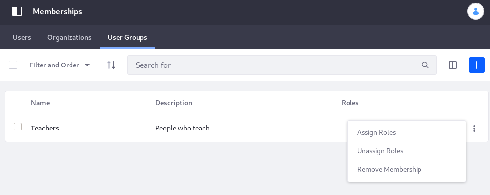

# Managing Site Membership and Permissions with User Groups

You can use User Groups to manage Site membership, Roles, and permissions.

## Managing Site Membership with User Groups

One of the primary use cases for User Groups is to manage Site membership. When you assign a User Group to a Site, that group's Users instantly become members of that Site.

Follow these steps to assign a User Group to a Site:

1. Open the Menu (), select the Site you want to work in, then open its Site Administration menu.

1. In the Site Administration menu, select *People* &rarr; *Memberships*.  This opens the Site Memberships screen.

   

1. In Memberships, select the *User Groups* tab. This tab displays any User Groups currently assigned to the Site.

1. Click the *Add* button (), select any User Groups you want to assign to the Site, then click *Done*.  The User Groups you selected now appear in the User Groups tab.

## Managing Site Permissions with User Groups

[Creating and Managing User Groups](./creating-and-managing-user-groups.md) describes how to assign a Regular Role to a User Group for Users who must have permissions across the portal. User Groups are often created so the group's Users can act only in one Site. Just as with Regular Roles, it starts by assigning the needed permissions for that action to a *Site Role*, and then assigning that Role to the User Group.

To grant Site scoped permissions to Users in a User Group,

1. [Create the User Group](./creating-and-managing-user-groups.md#creating-a-user-group).
1. Assign the User Group to a Site ([see above](#managing-site-membership-with-user-groups)).
1. Create the Site Role and define its permissions (see [Roles and Permissions](../roles-and-permissions/roles-and-permissions.md)).
1. Assign the Role to the User Group.

To assign an existing Site Role to an existing User Group that's already a member of the Site,

1. Open the Menu (), select the Site to work in, then open its Site Administration menu.

1. In the Site Administration menu, select *People* &rarr; *Memberships*.

1. In Memberships, select the *User Groups* tab to see the User Groups currently assigned to the Site.

1. Click the *Actions* button () for the User Group you want to assign to a Role, and select *Assign Roles*.

   

1. In the Assign Roles dialog, select the Role from the list and click *Done*.
