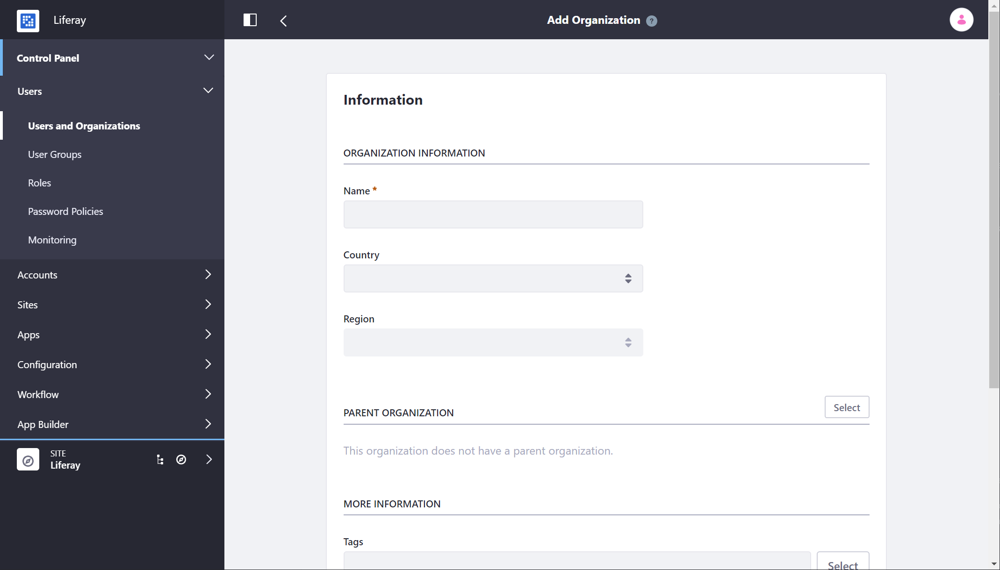

# Organization Roles

Coming soon!

<!-- What are Organization Roles and how are they different from Regular / Site roles? -->

<!-- ## Organization Roles and Permissions

A time-saving benefit of including Organizations into your portal design is that Organization administrators can assign Organization-scoped Roles to members of the entire Organization. For example, consider an IT Security group in a corporate setting. You could have a sub-Organization of your IT organization that handles security for all applications company-wide. If you grant the IT Security Organization the portal administrator Role, all members of the Organization get administrative access to the entire system. Suppose further that a User in this Organization was later hired by the Human Resources department. The act of removing the User from the IT Security Organization also removes the User's administrative privileges, since the privilege came from the IT Security Organization's Role. By adding the User to the HR Organization, any roles the HR Organization has (such as access to a benefits system in the portal) are transferred to the User. In this manner, you can design your portal to correspond with your existing organization chart and Users' permissions are granted according to their positions in the chart.

Of course, this is only one way to set things up. If you have more complex requirements for permissions within an Organization, you can create custom Organization-scoped Roles to assemble the permissions you wish to grant to particular Users. Alternatively, you can attach a Site to your Organization and use Site Teams to assemble the sets of permissions (see below). See [Roles and Permissions](../roles-and-permissions/defining-roles.md) for more details. -->

<!-- ## Organization Administrators -->

<!-- Organization Administrator vs Administrator vs. Site Administrator Comparison? I'm very focused on trying to use tables or some other method of describing distinctions between things because of the overall amount of text present in the article. -->

<!-- ## What can Organization Administrators Do?

Whenever you have a collection of Users that fits into a hierarchical structure, you can use Organizations to model those Users. Organization administrators can manage all the Users in their Organization *and* in any sub-Organization. Referring to the hierarchy above, for example, an Organization administrator of the Lunar Resort could manage any Users belonging to the resort itself, to any of the departments, or to any of a department's subdivisions. An Organization Administrator of the Physical Plant Department can manage any Users belonging to the Physical Plant Department itself, or to the Grounds Crew, the Janitorial Crew, or the Mechanical Crew. However, an administrator of the Physical Plant Department can't manage Users belonging to the Recreation Department or the Retail Group organization.

Organizations and sub-Organization hierarchies can nest to unlimited levels. Users can be members of one or many Organizations. The rights of an Organization administrator apply both to his/her Organization and to any child Organizations. Members of child Organizations are implicit members of their parent Organizations. This means, for example, that members of child Organizations can access the private pages of their parent Organizations. This behavior can be customized in the `Organizations` [section of the portal-ext.properties](https://docs.liferay.com/portal/7.2-latest/propertiesdoc/portal.properties.html#Organizations) file where the properties specific to Organizations are listed. -->

<!-- Organizations can enable distributed User administration. Organization administrators have an entirely different set of privileges than Site administrators. Site administrators maintain the pages, widgets, content, and membership of their Sites. To this end, they can set the membership type to Open, Restricted, or Private. They can also add Users to or remove Users from their Sites but cannot manage the Users themselves. If an Organization has a Site attached to it, the Organization Administrator has the same rights as a Site Administrator for managing the Site's content, but an Organization Site's members are the members of the Organization. Thus Organization administrators have more User management permissions than Site administrators: they can edit Users belonging to their Organization or any sub-Organization. They cannot add existing portal Users to their Organization, but they can create new Users within their Organization. Only portal administrators can add existing users to an Organization. -->

<!-- Organization administrators can't access the Control Panel by default, but it's not necessary. In their personal Sites, Organization administrators can click the *My Organizations* link to gain access to any Organizations they manage.

 -->
