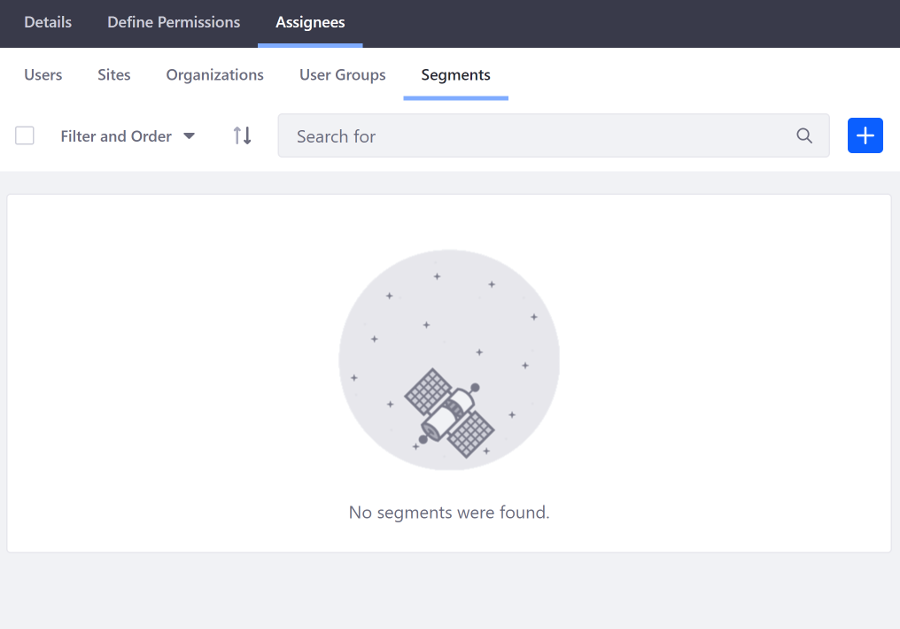

# Assigning Roles to User Segments

Since Liferay Portal CE 7.3 GA1, you can assign Roles to User Segments. Follow these steps:

1. Open the Product Menu and go to *Control Panel* &rarr; *Users* &rarr; *Roles*.
1. Open the Actions Menu next to the Role and select *Edit*.

    

1. Select the *Assignees* &rarr; *Segments* tab, and click the () to select a User Segment.

    

1. Check the box next to an existing User Segment and click *Add* to assign the Role to it. If the User Segment doesn't exist, you can click the () to create a new User Segment.

    

The selected User Segment(s) appear(s) in the list of assignees for the Role.

## Related Information

* [Creating User Segments](../../../../site-building/personalizing-site-experience/segmentation/creating-user-segments.md)
