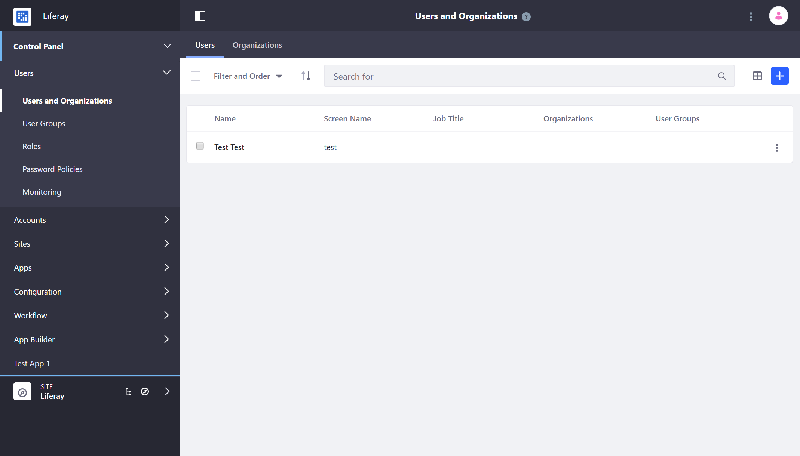
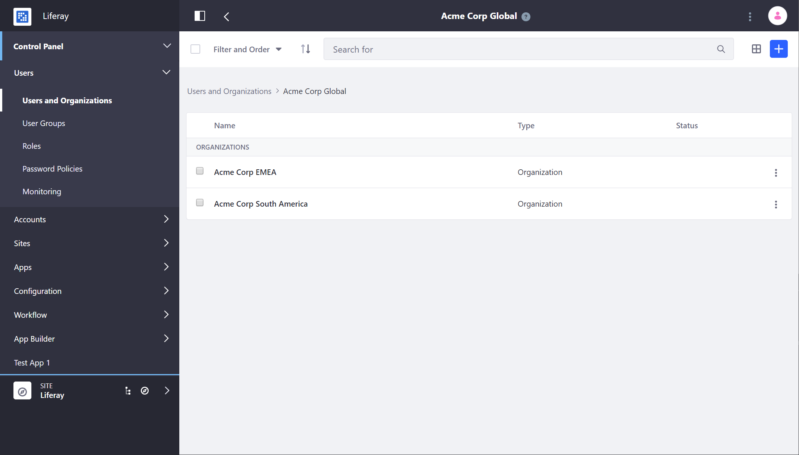

# Understanding Users

Every person who accesses a Liferay site is considered a User. Unauthenticated Users are considered *Guest* users. Liferay ships out-of-the-box with a default Admin user who has complete control of and access to the system. [Roles and Permissions](../roles-and-permissions/README.md) govern what users are able to see and do on a site.

Users break down into three general categories:

| User | Default Access | Notes |
| --- | --- | --- |
| [Administrator](../../getting-started/introduction-to-the-admin-account.md) | Liferay Admin with full system access | We *strongly* recommend that users change the password for this account promptly after installation. |
| Guest | View access to Public Pages and Sites. In most cases cannot create or add content unless explicitly permitted. | By default, Guest users can create an account on a Liferay Site to view and interact with *Public* Sites. |
| User | View access to Pages and Sites they are members of. Able to create content. | Users get defined default permissions and can be elevated to Organization or Site Administrators. |

## Managing Users

Users are managed in the *Users* section of the Control Panel.

Here, you can manage user metadata (name, department, etc.), permissions, and activation status.

### Adding Users

Administrators can add Users through the Users and Organizations section of the Control Panel or [through the API](../developer-guide/README.md). New users can be created by administrators, can register themselves if open registration is configured, or can be synced from an LDAP server. See [Adding and Managing Users](./adding-and-managing-users.md) to learn more.

#### Open Registration

By default, guest users can create User accounts.

See [Configuring Authentication](../../installation-and-upgrades/securing-liferay/authentication-basics.md) to learn more about configuring registration and authentication for users.

#### Configuring a User Directory

Organizations that manage users with LDAP can sync their LDAP server with Liferay to import users. See [this article](../devops/connecting-to-a-user-directory/connecting-to-an-ldap-directory.md) to learn more.

<!-- #### Other Methods

Are there other methods of adding users? -->

## Managing User Access

User access is controlled by Roles and Permissions. Permissions define what a User can and cannot do. Roles are groupings of permissions. Permissions are configured by defining permissions for a Role and assigning Users to pre-set Roles. To learn more about managing access for Users, see [Roles and Permissions](../roles-and-permissions/README.md).

## Organizing Users

Liferay has several tools to help you organize and administer Users.

[Organizations](../organizations/understanding-organizations.md) are an entity in Liferay that can group users in a distributed hierarchy. Practically, this means that large organizations can empower and delegate Users to administer their Organizations.

[User Groups](../user-groups/creating-and-managing-user-groups.md) are another way to group Users to simplify administration and assigning Roles. User Groups are simple lists of Users that can have Roles assigned to them.

## Related Information

* [Adding and Managing Users](./adding-and-managing-users.md)
* [Organizations](../organizations/understanding-organizations.md)
* [User Groups](../user-groups/creating-and-managing-user-groups.md)
