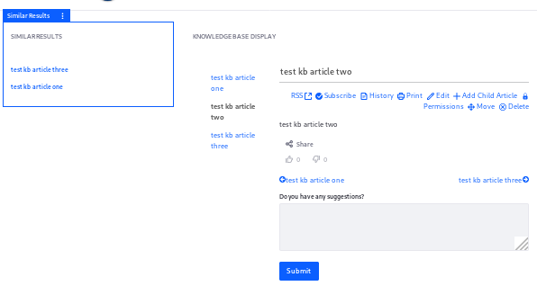

# Contributing Custom Content to the Similar Results Widget

> **Subscribers**

> **Availability:** This functionality relies on a Service Provider Interface (SPI) that's bundled with Liferay DXP 7.3+. It's available in Liferay DXP 7.2, from Fix Pack 5+, via installation of the Similar Results widget from [Liferay Marketplace](https://web.liferay.com/marketplace/-/mp/application/172465398).

You can display your application's custom content in the [Similar Results widget](../search-pages-and-widgets/similar-results.md) by implementing a `SimilarResultsContributor`. Note that for the contributor to work, the Similar Results widget must be able to detect your content as the main asset on a page. That means it must be displayable via a URL in a "Display Widget", like the supported Liferay DXP assets (e.g., blogs entries and wiki pages). Keep in mind that the Similar Results widget can already be used with any content displayed in Lifery DXP's Asset Publisher, without the need for a custom contributor.
<!-- I'd like to see the image highlight what someone should be noticing in this image because it is not immediately obvious. -->


Since the Knowledge Base application does not implement a `SimilarResultsContributor` for KB Articles out of the box, this example implements one. For simplicity, only KB Articles in the root folder of the application are dealt with here.

## Overview

1. [**Deploy an Example**](#deploy-an-example)
1. [**Walk Through the Example**](#walk-through-the-example)
1. [**Additional Information**](#additional-information)

## Deploy an Example

To get an example `SimilarResultsContributor` up and running on your instance of Liferay DXP,

1. Start Liferay DXP. If you don't already have a docker container, use

    ```bash
    docker run -it -p 8080:8080 liferay/dxp:7.2.10-sp2
    ```

    If you're running a different Liferay Portal CE version or Liferay DXP, adjust the above command accordingly.
<!--7.2.10-sp2 is my guess at the DXP container ID for a docker image with support for similar results-->

1. Download and unzip the [KB Article Similar Results Contributor example](./liferay-r1s1.zip).

    ```bash
    curl https://learn.liferay.com/dxp-7.x/using-search/developer-guide/liferay-r1s1.zip -O
    ```

    ```bash
    unzip liferay-r1s1.zip
    ```

1. From the module root, build and deploy.

    ```bash
    ./gradlew deploy -Ddeploy.docker.container.id=$(docker ps -lq)
    ```

    ```note::
       This command is the same as copying the deployed jars to /opt/liferay/osgi/modules on the Docker container.
    ```

1. Confirm the deployment in the Liferay Docker container console.

    ```bash
    STARTED com.liferay.learn.r1s1.impl_1.0.0 [1009]
    ```

1. Verify that the example contributor is working. Begin by opening your browser to `https://localhost:8080`

1. Add some KB Articles at  _Site Menu_ &rarr; _Content_ &rarr; _Knowledge Base_.

    Make sure they have similar _Title_ and _Content_ fields. You can use these Strings to create three articles (use the same string for title and content):

    _Test KB Article one_

    _Test KB Article two_

    _Test KB Article three_

1. Add the Knowledge Base Display widget to a page, followed by the Similar Results widget.

1. Open the widget configuration of the Similar Results widget, and make sure to set a value of _1_ for these settings:

    Minimum Term Frequency: 1
    Minimum Document Frequency: 1

1. Click on one of the KB Articles to select it for display, as the main asset.

    The Similar Results widget now shows other related KB Articles.
<!-- This image could be a bit larger and also have some sort of highlighting to indicate the element that we want to draw the readers attention towards. -->


Now that you verified that the example behaves properly, learn how it works.

## Walk Through the Example

Review the deployed example. It contains just one class: the contributor that enables custom content for the Similar Results widget.

* [Annotate the Contributor Class for OSGi Registration](#annotate-the-contributor-class-for-osgi-registration)
* [Review the `SimilarResultsContributor` Interface](#review-the-similarresultscontributor-interface)

### Annotate the Contributor Class for OSGi Registration

The `KBSimilarResultsContributor` implements the `SimilarResultsContributor` interface:

```java
@Component(service = SimilarResultsContributor.class)
public class KBSimilarResultsContributor implements SimilarResultsContributor {
```

The `service` component property registers your implementation as a `SimilarResultsContributor` service.

### Review the `SimilarResultsContributor` Interface

Implement the three methods from the interface.

```java
public void detectRoute(RouteBuilder routeBuilder, RouteHelper routeHelper);
```

Implement `detectRoute` to provide a distinctive portion of your entity's URL pattern, so that the Similar Results widget can detect if your contributor should be invoked. The URL pattern is added as an attribute of the `RouteBuilder` object. The `RouteHelper` is useful for retrieving the whole URL String for parsing.

```note::
   Only one `SimilarResultsContributor` is supported for each display portlet.
```

```java
public void resolveCriteria(CriteriaBuilder criteriaBuilder, CriteriaHelper criteriaHelper);
```

Implement `resolveCriteria` to use the main entity on the page to look up the corresponding search engine document. This will be invoked if the route detected indicates that your contributor is the appropriate one.

```java
public void writeDestination(DestinationBuilder destinationBuilder, DestinationHelper destinationHelper);
```

Implement `writeDestination` to update the main asset when a User clicks a link in the similar results widget.

### Complete the Similar Results Contributor

#### Implement the `detectRoute` Method

```java
@Override
public void detectRoute(RouteBuilder routeBuilder, RouteHelper routeHelper) {

    String[] subpath = StringUtil.split(_http.getPath(routeHelper.getURLString()), Portal.FRIENDLY_URL_SEPARATOR);

    String[] parameters = StringUtil.split(subpath[subpath.length - 1], CharPool.FORWARD_SLASH);

    if (!parameters[0].matches("knowledge_base")) {
        throw new RuntimeException("KBArticle was not detected");
    }

    routeBuilder.addAttribute("urlTitle", parameters[1]);
}
```

Implement `detectRoute` to inject logic checking for a distinctive portion of your entity's URL pattern. The Similar results widget uses this check to find the correct `SimilarResultsContributor`. If your entity's display URL is detected, add at least one attribute to the URL route for use later. Here we're checking for `"knowledge_base"` in the Friendly URL, and adding `"urlTitle"` as an attribute to the `RouteBuilder` passed in the method signature if it's detected.

The `routeHelper.getUrlString` call is important, as it can be used to retrieve the relative URL of the detected asset within the virtual instance. For example,

```sh
/web/guest/page-title/-/knowledge_base/kb-article-url-title
```

The ID being added as an attribute to the `RouteBuilder` is used to fetch the entity and the corresponding search engine document in the `resolveCriteria` method.

#### Implement the `resolveCriteria` Method

```java
@Override
public void resolveCriteria(CriteriaBuilder criteriaBuilder, CriteriaHelper criteriaHelper) {

    long groupId = criteriaHelper.getGroupId();

    String urlTitle = (String) criteriaHelper.getRouteParameter("urlTitle");

    KBArticle kbArticle = _kbArticleLocalService.fetchKBArticleByUrlTitle(groupId,
            KBFolderConstants.DEFAULT_PARENT_FOLDER_ID, urlTitle);

    if (kbArticle == null) {
        return;
    }

    AssetEntry assetEntry = _assetEntryLocalService.fetchEntry(groupId, kbArticle.getUuid());

    if (assetEntry == null) {
        return;
    }

    String uidField = String.valueOf(kbArticle.getPrimaryKeyObj());

    int buildNumber = ReleaseInfo.getBuildNumber();

    if (ReleaseInfo.getBuildNumber() == ReleaseInfo.RELEASE_7_2_10_BUILD_NUMBER) {

        uidField = String.valueOf(kbArticle.getResourcePrimKey());
    }

    criteriaBuilder.uid(Field.getUID(assetEntry.getClassName(), uidField));
}
```

Look up the search engine document corresponding to the page's displayed entity. You must provide the `criteriaBuilder.uid` method the value of the appropriate search engine document's `uid` field (this is usually equal to the Elasticsearch-specified `_id` field in the document). In the Liferay DXP index, this field is a composition of the entry class name and the class primary key. Pass both as Strings to `Field.getUID` to obtain the value. Our example starts by fetching the model entity using the ID you added to the attribute in the `detectRoute` method (the `urlTitle`), and then uses it to retrieve the asset entry. 

```important::
   There's a difference between Liferay DXP 7.2 and Liferay DXP 7.3, so a condition to check the version, with logic for each, is provided here. In Liferay DXP 7.3, `getPrimaryKeyObj` is used in conjunction with the class name, whereas in Liferay DXP 7.2, `getResourcePrimKey` is needed.
```

Now that matching documents can be found, write the destination URL so the similar results are updated.

#### Implement the `writeDestination` Method

```java
@Override
public void writeDestination(DestinationBuilder destinationBuilder, DestinationHelper destinationHelper) {

    String urlTitle = (String) destinationHelper.getRouteParameter("urlTitle");

    AssetRenderer<?> assetRenderer = destinationHelper.getAssetRenderer();

    KBArticle kbArticle = (KBArticle) assetRenderer.getAssetObject();
    destinationBuilder.replace(urlTitle, kbArticle.getUrlTitle());

}
```

Implement `writeDestination` to update the main asset when a user clicks a link in the Similar Results widget. The More Like This query is re-sent to the search engine, and the Similar Results list is re-rendered to match the new main asset. For KB Articles, the entirety of the work is to replace the `urlTitle` in the original URL (for the main asset) with the `urlTitle` of the matched entity.

The `destinationHelper.getRouteParameter` call is important. As the only method from the `DestinationHelper` that is a pre-search operator, it will always return data from the currently selected main asset, prior to re-rendering the main asset or the Similar Results links. The remainder of the `DestinationHelper` methods, including the other one shown here, `getAssetRenderer`, return data for a matched asset. This method is run iteratively for each matched result.

#### Declare the Service Dependencies

This code relies on services deployed to an OSGi container: `AssetEntryLocalService`, `KBArticleLocalService`, and `Http`. Declare your need for them using the Declarative Services `@Reference` annotation, provided by `org.osgi.service.component.annotations.Reference`. Set them into private fields.

```java
@Reference
private AssetEntryLocalService _assetEntryLocalService;

@Reference
private Http _http;

@Reference
private KBArticleLocalService _kbArticleLocalService;
```

## Additional Information

Since each implementation of an entity's URLs is likely to differ significantly, see the `SimilarResultsContributor` [interface](https://github.com/liferay/liferay-portal/blob/7.3.2-ga3/modules/dxp/apps/portal-search-similar-results/portal-search-similar-results-web-spi/src/main/java/com/liferay/portal/search/similar/results/web/spi/contributor/SimilarResultsContributor.java) and the bundled [implementations](https://github.com/liferay/liferay-portal/tree/7.3.2-ga3/modules/dxp/apps/portal-search-similar-results/portal-search-similar-results-web/src/main/java/com/liferay/portal/search/similar/results/web/internal/contributor) on GitHub if you need more inspiration when writing your own application's contributor.

Much of the work involved in contributing your application's custom content to the Similar Results widget is in working with the display URL. To learn how Liferay's own assets create their display URLs, inspect the `getURLView` method of an entity's `*AssetRenderer` class.

* [`JournalArticleAssetRenderer#getURLView`](https://github.com/liferay/liferay-portal/blob/7.3.2-ga3/modules/apps/journal/journal-web/src/main/java/com/liferay/journal/web/internal/asset/model/JournalArticleAssetRenderer.java#L352-L383), Liferay DXP 7.3.2 GA3
* [`WikiPageAssetRenderer#getURLView`](https://github.com/liferay/liferay-portal/blob/7.3.2-ga3/modules/apps/wiki/wiki-web/src/main/java/com/liferay/wiki/web/internal/asset/model/WikiPageAssetRenderer.java#L232-L249), Liferay DXP 7.3.2 GA3
* [`BlogsEntryAssetRenderer#getURLView`](https://github.com/liferay/liferay-portal/blob/7.3.2-ga3/modules/apps/blogs/blogs-web/src/main/java/com/liferay/blogs/web/internal/asset/model/BlogsEntryAssetRenderer.java#L202-L218), Liferay DXP 7.3.2 GA3
* [`DLFileEntryAssetRenderer#getURLView`](https://github.com/liferay/liferay-portal/blob/7.3.2-ga3/modules/apps/document-library/document-library-web/src/main/java/com/liferay/document/library/web/internal/asset/model/DLFileEntryAssetRenderer.java#L280-L297), Liferay DXP 7.3.2 GA3

As mentioned earlier, this example demonstrates creating a `SimilarResultsModelDocumentContributor` that will work with KB Articles in the root folder of the application. Adding support for KB Folders is possible, and is an interesting exercise for the motivated reader. Look at the source code for the [`DocumentLibrarySimilarResultsContributor`](https://github.com/liferay/liferay-portal/blob/7.3.2-ga3/modules/dxp/apps/portal-search-similar-results/portal-search-similar-results-web/src/main/java/com/liferay/portal/search/similar/results/web/internal/contributor/document/library/DocumentLibrarySimilarResultsContributor.java) for inspiration.

### Troubleshooting: Asset UID Architecture

The `uid` is constructed in a standard way as of Liferay DXP 7.3. The `com.liferay.portal.search.internal.model.uid.UIDFactoryImpl` class is responsible for setting the `uid` for all documents under control by Liferay's indexing architecture. Since it's now standardized, there need be no guesswork on your part.

Similarly, in versions 7.2 and 7.1, if an entity is indexed with the Composite Indexer APIs (i.e., it has a `ModelDocumentContributor` class), the `uid` is set by Liferay's implementation and is standardized.

However, entities indexed with the legacy Indexer API (i.e., the entity has a `*Indexer` class that extends Liferay's `BaseIndexer`) may have overridden the logic that sets the `uid`, so it's worth looking into an entity's indexing implementation.

## Conclusion

By implementing a `SimilarResultsContributor`, you can contribute your own custom content for display in the Similar Results widget.
