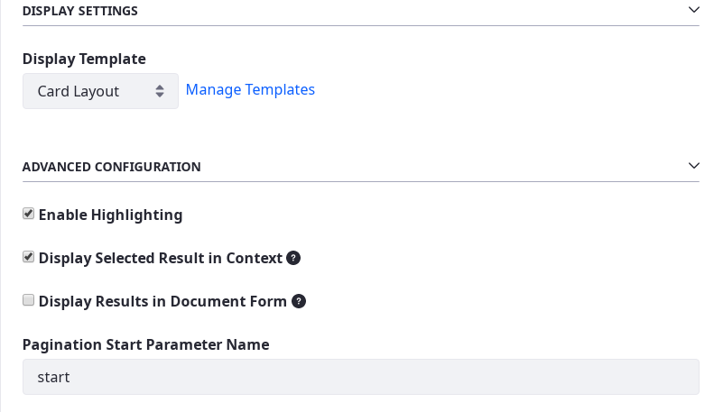
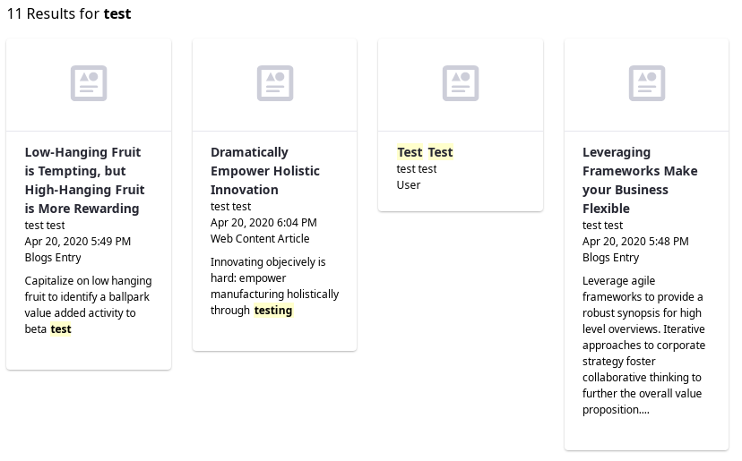
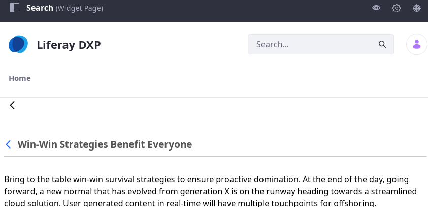
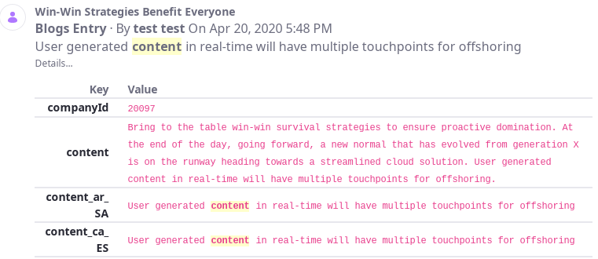

# Configuring the Search Results Widget

Configure the Search Results widget by opening its options menu () and selecting *Configuration*. 

Settings can be conceptually divided into display, pagination, and federated search settings. In addition, during development and testing, you can inspect the search engine document for each result by checking _Display Results in Document Form_.

## Displaying Search Results 

**Display Template:** Select the [Widget Template](./../../../site-building/displaying-content/customizing-widgets/styling-widgets-with-widget-templates.md) that styles the returned search results. The default display style is a paginated list. Each list item is a summarized hit to a search query. Click the _Manage Templates_ link to add a new Widget Template for the Search Results widget.

----

**Enable Highlighting:** Highlight the search terms where they appear in the search result's title or summary.

----

**Display Selected Result in Context:** Show clicked assets in their native display widgets, if one is detected on a page in the same Site. For example, if you click on a blog post in the search results, you see the Blogs Entry in the Blogs application. You're no longer in the search context after clicking on a search result.

When this option is unchecked or an asset is not displayed on a page in the Site, the asset instead displays in an Asset Publisher window while still in the search page context. If you have the right permissions, you can even edit the content directly from the Search context. Click the back arrow to return to the search results.

## Configuring Results Pagination

Results pagination appears at the bottom of the search results: 

**Pagination Start Parameter Name:** Set the name of the URL parameter for the results page. If the default value *start* is preserved (and the search is for *test*), you can see the parameter when the User navigates to the second results page:

        http://localhost:8080/web/guest/search?q=test&start=2

**Pagination Delta:** Set the number of results to display per results page. Defaults to *20* unless you customized the `search.container.page.default.delta` [property](https://docs.liferay.com/ce/portal/7.3-latest/propertiesdoc/portal.properties.html#Search%20Container) in your `portal-ext.properties` file.

**Pagination Delta Parameter Name:** Set the name of the URL parameter that stores the Pagination Delta value (`delta` by default). This parameter is visible in the browser if the User changes the number. If the User selects 10 results per page and searches for *test*, the Search Page is reloaded with this URL:

        http://localhost:8080/web/guest/search?q=test&delta=10

## Displaying Results from Alternate Indexes

**Federated Search Key:** If this widget is participating in a search on a non-default index, enter the key of the alternate search index. If not set, the widget participates in the default search, against the default index (`liferay-[companyId]`). This value is usually the name of an application-defined index. 

<!-- I am starting to get lost. Maybe have a link to what a non-default index is and how the widget could participate in a search on it? -->

**Fields to Display:** If searching an alternate index using the Federated Search Key configuration, specify what fields to search from that index. 

<!-- Is there some documentation on how to set up federated search that we can link to here? -->

## Inspecting Search Engine Documents

Never use this option in production environments. 

**Display Results in Document Form:** Display results as search [documents](../../developer_guide.md). Use this feature while developing your site to view search responses in their indexed, document-based format. Part of writing search indexers is to convert search engine documents (the objects that get indexed) to the actual Java object and back again. To use this setting, enable it and then click the *Details...* link below a Search Results summary: the result's document view is expanded for your inspection.

For further reading, check out how to [return suggestions for better search terms](./enabling-search-suggestions.md) (for example, "Did you mean...") when not enough results are returned initially.
