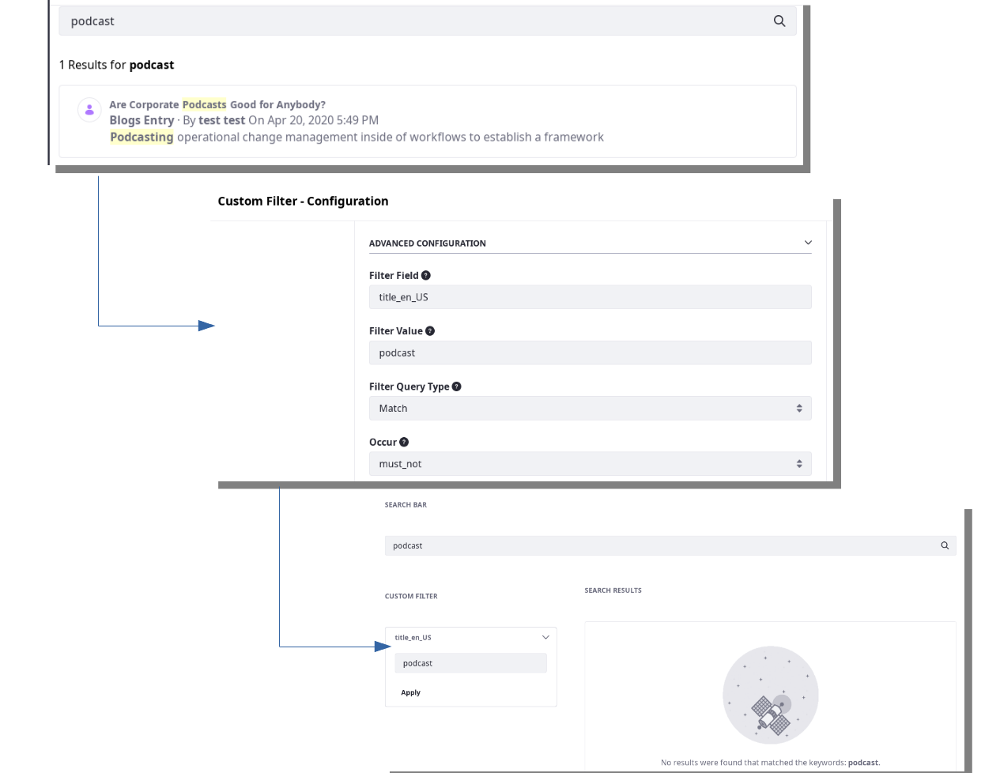
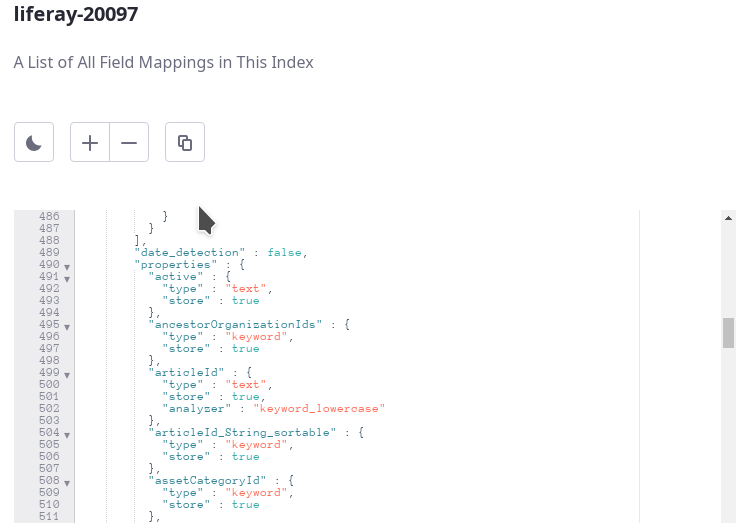

# Filtering Search Results with the Custom Filter Widget

With Custom Filters, you can contribute queries to the main search query, filtering search results to exert control over what's returned in the Search Results widget. Make the filter widgets visible or invisible to the search Users, and decide if they're changeable or immutable.

There are many use cases you can satisfy by incorporating Custom Filters into your search page. Some demonstrative articles are planned to show you some of the filtering capabilities at your disposal.

| Use Case | `Configuration` _(Value)_ |
| -----------| ----------- |
| **User Title Filter:** End Users directly manipulate the filter key to refine results to the one they were looking for, using the Title |`Filter Field` _(title\_en\_US)_   `Filter Value` _(podcast)_   `Filter Query Type` _(Match)_   `Occur Type` _(must_not)_|
| **Hard-Coded Filtering:** An administrative User configures the Search Page with filters that are invisible and unchangeable for end Users | ***Add to the above configuration***   `Invisible` _(True--checked)_   `Immutable` _(True--checked)_|

Custom filters can do so many things, it's impossible to list them all. What follows is a widget configuration tour. Separate documentation will be written to provide a how-to demonstration of Custom Filters.

To explore all the options you have with the Custom Filter widget, you need one on the page.

## Adding a Custom Filter

To get started with Custom Filters,

1. Open the Add menu () for the page and expand the Widgets section.

1. From the Search section, drag a Custom Filter onto the page.

## Custom Filter Configuration

To begin filtering search results, open the widget Options menu () and click _Configuration_.

**Filter Field (text):** Most often, filters operate on a specific field. Set the name of the indexed field to be filtered (for example, `title`). You won't need this if the Filter Query Type is set to a type that doesn't require a field, such as _Regexp_.

The Query String and Script queries do not require a Filter Field to be set.  All other queries require at least one field. 
<!--Note: Multi Match and Simple Query String take an array of fields according to the Elasticsearch docs, but our config doesn't seem to support it. -->

To find the fields present in the Liferay DXP index, use [the Field Mappings UI in the Control Panel](#finding-fields)

**Filter Value (text):** For most filters, you must enter a text value here that specifies the text to apply the filter on in the specified field (for example, set a _Match_ query to the text _street_ on the `title_en_US` field). Some Filter Query Types require special notation, as in the case of the _Regexp_ filter. 

**Filter Query Type (select list):** Select the query type to filter results by. Available types include Bool, Exists, Fuzzy, Match, Match Phrase, Match Phrase Prefix, Multi Match, Prefix, Query String, Regexp, Script, Simple Query String, Term, Wildcard. To learn more about these queries, visit the [Elasticsearch documentation](https://www.elastic.co/guide/en/elasticsearch/reference/7.x/query-dsl.html).

**Occur (select list):** Set the occurrence type for the query being contributed to the search. Options include Filter, must, must_not, and should. To understand each type, see the [Elasticsearch documentation](https://www.elastic.co/guide/en/elasticsearch/reference/7.x/query-dsl-bool-query.html). 

**Query Name (text):** Set the name of the contributed query. This is unnecessary unless this filter acts as a parent query to another filter that contributes child clauses; in that case set this filter's Query Name as the child filter's Parent Query Name.  This parent/child behavior is only available for filters of type Bool.

**Parent Query Name (text):** When contributing a child clause to a Bool query, set this to match the Query
Name configured in the parent Custom Filter widget. Otherwise, leave it blank.

**Boost (number):** [Boost](https://www.elastic.co/guide/en/elasticsearch/reference/7.x/query-dsl-term-query.html#term-field-params) the score of the results matching this query. Specify any whole or decimal number here that makes sense. If you always want results matching this at the top, set the Boost value really high (e.g., _1000_).

**Custom Heading (text):** Enter the heading to display for this filter. If not set, the Filter Field's
value is displayed.

**Custom Parameter Name (text):** Specify a URL parameter name for the filter. If not set, the Filter Field's
value is used.

**Invisible (boolean):** If checked, the widget is invisible to regular users. The Filter Value from the configuration is applied by default, but users can still filter for other values via URL Parameter. Don't worry, you can shut that down if you need to with the Immutable setting (see below).

**Immutable (boolean):** Enable this to ensure that the Filter Value cannot be changed by regular users. The widget becomes invisible to them _and_ filter values set via URL parameters are not accepted. The Filter Value set in the widget configuration is applied at all times (unless it's disabled).

**Disabled (boolean):** If checked, the query is ignored and doesn't participate in searches. This gives you a quick way to stop the filter, but keep the configuration so it can be re-enabled later.

**Federated Search Key (text):** Enter the key of an alternate Search this widget is participating on. If it's set, be aware that the default @product@ index isn't searched at all. If not set, this widget participates on the default search. Values in this field typically match the name of an application-defined index.

## Finding Fields

To find the fields you can filter by in the Custom Filter widget, Users with the proper permissions can navigate to *Control Panel* &rarr; *Configuration* &rarr; *Search*.  From there, open the Field Mappings tab and browse the mappings for the `liferay-[companyId]` index. Scroll to the `properties` section of the mapping

