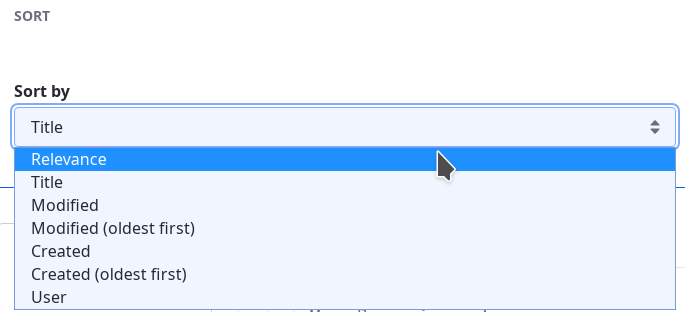

# Sorting Search Results

Search results are displayed in the [Search Results](./search-results.md) widget, ordered by [relevance](./understanding-search-results.md) (as calculated by the [search engine](https://www.elastic.co/guide/en/elasticsearch/guide/master/scoring-theory.html)) by default. With the Sort widget, you can exert control over the order of returned results, no code necessary.

Add the widget to a [Search Page](../../search-pages-and-widgets/working_with_search_pages.rst) and begin sorting results.

Out of the box, order results in these ways as an alternative to relevance sorting:

- alphabetically by Title
- by the Modified date (newest first by default, or choose oldest first)
- by the Create date (newest first by default, or choose oldest first)
- alphabetically by the User that created each matching asset

Choose from one of the Sort widget's pre-configured sorting strategies or one you configure. 

It's also possible to delete unwanted sort options from the widget.

## Adding the Sort Widget to a Page

To get started with the Sort widget,

1. Open the Add menu () for the page and expand the Widgets section.

1. From the Search section, drag the Sort widget onto the page.



## Configuring the Sort Widget

From the Sort widget's  &rarr; Configuration screen, you can

- Edit existing Sort options
- Delete options
- Add new options


To access the widget configuration screen, open the widget Options menu () and click _Configuration_.

Each Sort option has two fields: _Label_ and _Field_.

**Label:** Set the displayed label for the type of sort being configured.

**Field:** The `fieldName` of the indexed field to sort. Most of the time this is a [keyword](https://www.elastic.co/guide/en/elasticsearch/reference/7.x/keyword.html) field. Other acceptable options are `date` and any [numeric datatype](https://www.elastic.co/guide/en/elasticsearch/reference/7.x/number.html). There's even a way for persistent search administrators to coerce `text` fields into behaving with the Sort widget. Keep reading for details.

## Finding Sortable Fields

To find the fields available for use in the Sort widget, Users with the proper permissions can navigate to *Control Panel* &rarr; *Configuration* &rarr; *Search*.  From there, open the Field Mappings tab and browse the mappings for each index.  Scroll to the `properties` section of the mapping, and find any `keyword` field, `date` field, or a field with any numeric datatype. The `type` field is instructive:
 
    "type" : "keyword"

    "type" : "date"

    "type" : "long"

What if you really need to sort by a `text` field? You can do it by adding a new version of the field to the index, with the type `keyword`. Don't worry; you don't need to code anything to do this. From the field mappings screen mentioned above, look at the `firstName` field in the index called `liferay-[companyID]`.  In fact, look at the next entry as well:

```json
"firstName" : {
    "type" : "text",
    "store" : true
},
"firstName_sortable" : {
    "type" : "keyword",
    "store" : true
},
```

There's a corresponding field with the suffix `_sortable`, and of the correct type for sorting (`keyword`). How did that get there? Via the [portal property](https://docs.liferay.com/portal/7.3-latest/propertiesdoc/portal.properties.html#Lucene%20Search):

```properties
index.sortable.text.fields=firstName,jobTitle,lastName,name,screenName,title
```

All the text fields listed here have a `fieldName_sortable` counterpart created automatically in the index. To add more, copy this value into a [`portal-ext.properties`](./../../../installation-and-upgrades/reference/portal-properties.md) file into your Liferay Home folder, add any new field names you need to sort by, and restart the server.

## Adding New Sort Options

To sort by the new field, use the plus symbol below any option's _Field_ configuration make sure to use the `fieldName_sortable` version of the field in the widget configuration. 

To add a new sort option that's already of the proper datatype, use the plus symbol below any option's _Field_ configuration and fill in the fields. The order of options here in the configuration screen matches the order Users see in the select list while configuring the widget for their search.

## Editing and Deleting Sort Options

To edit an existing option, edit the text in its configuration section.

To delete an existing option, use the minus symbol below its _Field_ configuration.

## Controlling the Sort Order

To control the order for the sort option, add a plus or minus symbol after the `fieldName`. Look how it's done for the existing sort options labeled _Created_ and _Created (oldest first)_ to understand how it works:

**Label:** _Created_
**Field:** `createDate-`

The `-` sign following the field name indicates that the order is _descending_.  Choosing to sort with this brings search results created most recently to the top of the list.

**Label:** _Created (oldest first)_
**Field:** `createDate+`

The `+` sign following the field name indicates that the order is _ascending_.  Choosing to sort with this brings the oldest (by creation date) results to the top of the list.
