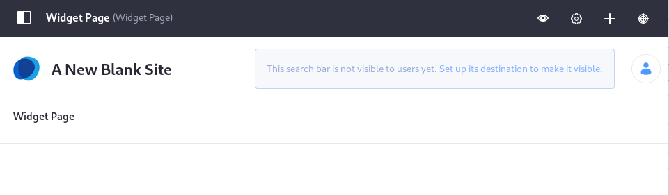

# Search Pages

The default search page is located at [`localhost:8080/web/guest/search`](http://localhost:8080/web/guest/search). If you have a running Liferay DXP with some content in it, you can navigate there and execute a search. By default, this page is hidden page in the default site. Users are routed to this hidden page when they enter search terms in a *Search Bar* widget. The search page is also and where users browse search results.


Users can opt to customize search experience by creating a new Search page, adding different Search Widgets, and tweaking a variety of available widget configurations to provide a precise and tailored search experience for a site's users. Using the [default](#default-search-pages) search page can be a good starting point to creating your own custom search pages.

```note::
   Newly created sites do not get a Search Page created by default. You'll need to create one. You can use the existing Search Page Template or, if you're in need of a fully customized experience, `build your own search page from the ground up.<#creating-a-search-page>`_
```



## Default Search Pages

Using the default site and the default theme with the default search settings, the search experience has two components for end users:

1. A search bar embedded in the header of each page.
1. A default search page where search requests are routed and results are displayed.

Behind the scenes, The search bar widget points to a hidden search page with the friendly URL `/search`.


Enter a search term and you're redirected to the default search page, where results are displayed in the Search Results widget.


The default search page is based on the Search page template, but it doesn't inherit changes from the template by default. That means you can customize the search page directly without changing the template's inheritance configuration.


If you require just a few changes to the default page, don't abandon it and create one manually. Just make the configuration changes you need, including adding, configuring, and removing widgets on the page. On the other hand, if you want a clean break from the default search page, starting from scratch is an option.

## Creating a Search Page

You can create search pages with a page template, or use a manually configured search page for a single Site. See [Using a Search Page Template](./using-a-search-page-template.md) to learn about search page templates; see [Manually Creating a Search Page](./manually-creating-a-search-page.md) to learn about configuring a search page individually per Site.

After choosing your approach and reading here to get your search page up and running, read through the more detailed articles on the various search widgets and the configuration documentation to understand the full suite of configuration options.
