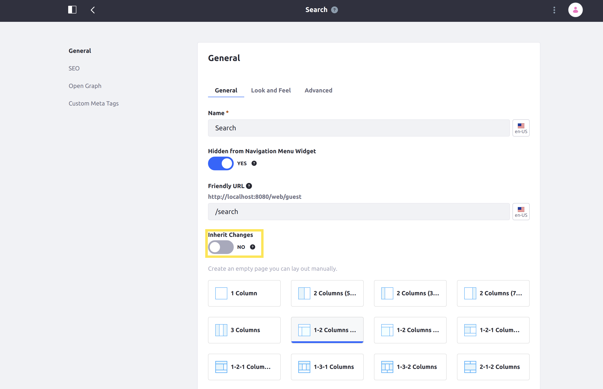

# Using a Search Page Template

The default search page is backed by a Global scope page template (on the Global Site), and manually created search pages can use the template, too. Out-of-the-box, the Search Page Template includes a Search Bar, Search Results, Search Suggestions, Search Options, and a bunch of Search Facets:


The template can be used in two ways:

1. Enable inheriting changes to the template, if you want the search page to get any updates made to the template at a later date. Toggle the _Inherit Changes_ option within the page's configuration to enable inheriting changes.

    

    > For new pages, you can enable this when the page is first created. For an existing page based on the search template, navigate to the Site menu → _Site Builder_ → _Pages_, and then click _Configure_ within the  menu.

    ```warning::
       Some settings within the page configuration will become unavailable if the page is set to inherit changes from the page template.
    ```

1. Create a page based on the template, but independently configure it after the initial creation. Leave the _Inherit Changes_ option unchecked within the page's configuration so that you can freely modify the search page without changing the template.

By default, all widgets use the _Barebone_ Application Decorator: unless there's content to render in the widget, the widget body is hidden. The header and the widget options icon are displayed if you hover over the widget with your mouse. Because of this, when you visit a search page created from the default search page template, you won't see certain widgets fully rendered.

By contrast, when you add a search widget to a page manually, they use the _Borderless_ decorator (by default), which shows more of the widget even when there is no content to display.
