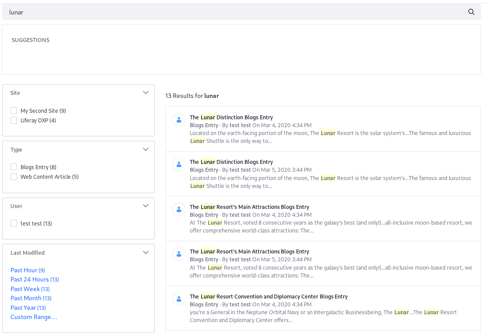

# Using a Search Page Template

The default search page is backed by a Global scope page template. Manually created search pages can use that same template as a baseline. Out-of-the-box, the Search Page Template includes a Search Bar, Search Results, Search Suggestions, Search Options, and several Search Facet widgets:

<!-- Please update image without Lunar Resort.  -->

The template can be used in two ways: to [manage search pages](#using-a-page-template-to-manage-search-pages) created using the template, or to [create a baseline search page](#using-a-page-template-to-create-a-baseline-search-page) that is configured independently of the template.

## Using a Page Template to Manage Search Pages

Managing Search Pages created using a Page Template can be done by enabling the *Inherit Changes* feature when configuring the Search page.

To create a search page using a template and have it inherit changes made to the template, do the following:

1. Navigate to your desired Site by using the [Site Menu](../../../getting-started/navigating-dxp.md#site-menu).

1. Go to *Site Builder* &rarr; *Pages* under the Site Menu.

1. On the Pages page, click the *Add* button () to create a top-level page.

1. Select a Search page template. To use the default Search Page template, click on *Global Templates* &rarr; *Search*. Enter a name for your new search page and click *Save*.

1. Toggle the _Inherit Changes_ option within the page's configuration to enable inheriting changes.

    

    ```tip::
       For new pages, you can enable this when the page is first created. For an existing page based on the search template, navigate to the Site menu → *Site Builder* → *Pages*, and then click *Configure* within the Actions menu.
    ```

    ```warning::
       Some settings within the page configuration will become unavailable if the page is set to inherit changes from the page template.
    ```

Your search page will now be updated whenever the Page Template is updated.

## Using a Page Template to Create a Baseline Search Page

You can also use a Page Template as a starting point for building a search page and then tweak the page separately from any changes that may be made to the base Page Template.

To create a search page using a template that does not inherit further changes from the Page Template, do the following:

1. Navigate to your desired Site by using the [Site Menu](../../../getting-started/navigating-dxp.md#site-menu).

1. Go to *Site Builder* &rarr; *Pages* under the Site Menu.

1. On the Pages page, click the *Add* button () to create a top-level page.

1. Click a Search page template, to use the default Search Page template, click on *Global Templates* &rarr; *Search*. Enter a name for your new search page and click *Save*.

1. Leave the _Inherit Changes_ option unchecked in the page configuration.

The page is now created based on the template and can be further tweaked and configured without receiving any changes made to the page template.

## Using the Default Search Page Template

By default, all widgets use the _Barebone_ Application Decorator: unless there's content to render in the widget, the widget body is hidden. The header and the widget options icon are displayed if you hover over the widget with your mouse. Because of this, when you visit a search page, you won't see certain widgets fully rendered.

<!-- A screenshot or two comparing/contrasting the apperaance of Barebone vs. Borderless would be helpful -->

By contrast, when you add a search widget to a page manually, they use the _Borderless_ decorator (by default), which shows more of the widget even when there is no content to display.
