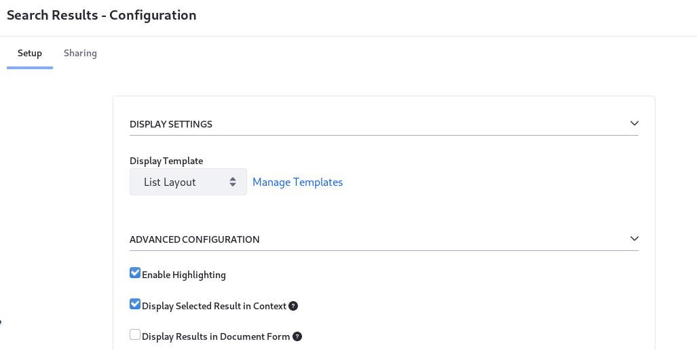
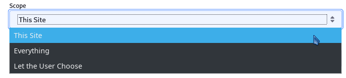

# Configuring Search

Coming soon!

<!-- I commented out everything here because it's an overwhelming amount of information and I am not sure about what the identity/goal of this article is. Is it primarily a configuration reference? "Here's all the configurations, organized by scope, and a description of what the configuratoins are for" - is the takeaway from this article. If it is, then it maybe is better titled as a something like "Search Configuration Reference"

Search in Liferay DXP can be configured in lots of ways. Once you understand the concept of [configuration scope](https://help.liferay.com/hc/en-us/articles/360029131551-Introduction-to-Setting-Up#configuration-scope), you'll understand where to find a certain configuration screen.

* Many search configurations affect the system scope (e.g., re-indexing actions and configuring the search engine connector).
* Search tuning configurations affect the virtual instance.
* Creating new Search Pages affects search at the site scope.
* Configuring the search widgets is widget-scoped configuration, but some can also be thought of as page-scoped configuration.


So the term _Configuring Search_ is very broad, as it affects all the available scopes. This is a high level overview of what search behavior is configurable out of the box, and importantly, where to find search configuration options.

## Widget Scoped Search Configuration

Several search widgets are available to place on Pages. Each one has its own configuration options:



**Search Results**: Configure how search results are displayed. Read [here](https://help.liferay.com/hc/en-us/articles/360029133971-Search-Results) for more information.

**Search Bar**: Configure the behavior of how search keywords are processed. See [here](https://help.liferay.com/hc/en-us/articles/360029133811-Searching-for-Assets#search-bar) for more information.

**Search Facets**: Configure each facet's behavior and URL parameters. See [here](https://help.liferay.com/hc/en-us/articles/360029133851-Facets) for more information.

**Search Options**: This is a special case, where configuring this widget defines page scoped behavior. Add the Search Option widget to a page and define two booleans for the Search Page:

* Allow Empty Searches: By default, failure to enter a keyword returns no results. Enabling this ensure that _all_ results are returned when no keyword is entered in the Search Bar.
* Basic Facet Selection: By default, facet counts are recalculated after each facet selection. Enable this to turn off facet recounting.

**Search Suggestions**: Suggest better queries and spell check queries. See [here](https://help.liferay.com/hc/en-us/articles/360029133811-Searching-for-Assets#search-suggestions) for more information.

**Search Insights**: Add this to the Search Page to inspect the full query string that's constructed by the back-end search code when the User enters a keyword. Only useful for testing and development. See [here](https://help.liferay.com/hc/en-us/articles/360028721312-Search-Insights) for more information.

**Custom Filter**: Add a widget to the page for each of the filters you'd like applied to the search results. Let search page users see and manipulate the filters or make them invisible and/or immutable. See [here](https://help.liferay.com/hc/en-us/articles/360028721272-Filtering-Search-Results-with-the-Custom-Filter-Widget) for more information.

**Sort**: Let Users reorder the search results based on the value of certain `keyword` fields in the index. For example, show results in alphabetic order of the Title field. The default order is determined by the search engine's _Relevance_ calculation. See [here](https://help.liferay.com/hc/en-us/articles/360029041691-Sorting-Search-Results-with-the-Sort-Widget) for more information.

**Low Level Search Options:** Configure the search widgets to participate in a search that's aimed at an index other than the _Company Index_. The company index is where the Liferay DXP assets index their data, so many installations will not need this widget. See [here](https://help.liferay.com/hc/en-us/articles/360032607571-Low-Level-Search-Options-Searching-Additional-or-Alternate-Indexes) for more information.

**Similar Results:** Display similar search results to an asset being displayed on a page. Documentation will be available soon.

**X-Pack Monitoring:** Liferay Enterprise Search subscribers can access [Elastic's Kibana](https://www.elastic.co/kibana) monitoring tool inside a widget placed on a Liferay DXP Page.

## Site Scoped Search Configuration

By the strict definition of [Site Scoped Configuration](https://help.liferay.com/hc/en-us/articles/360029131551-Introduction-to-Setting-Up#configuration-scope), search doesn't have any. However, [Search Pages](https://help.liferay.com/hc/en-us/articles/360028821052-Configuring-Search-Pages) influence Site-specific search behavior. Commonly, Search Pages contain search widgets configured to search for all content within a particular Site.



There are some important configuration nuances to be aware of when using the Search widgets:

If the Header Search (the search bar embedded in the default theme) uses the Search Bar widget, its configuration always requires a _destination page_ to be set, where Users are redirected to complete their search activity, interacting with the other Search widgets (Results, Facets, Suggestions etc.). [Search destination pages](https://help.liferay.com/hc/en-us/articles/360028821052-Configuring-Search-Pages) are ordinary pages holding the Search widgets. You can have as many pages with Search widgets across the Site as you want.

The Search Bar widget is instanceable, so one page can contain multiple Search Bar widgets configured differently. All Search Bar instances must point to a Search Page within the Site to be effective.

```important::
    If the destination Search Page has a Search Bar widget instance besides the embedded Header Search, the configurations of the Header Search take precedence over the page's widget instance.

    Conversely, searching from a Search Bar widget instance on other pages honors their configurations, even if they differ from the Header Search configuration.
```

See the documentation on [configuring a Search Bar](https://help.liferay.com/hc/en-us/articles/360029133811-Searching-for-Assets#configuring-the-search-bar) for more information.

## Instance Scoped Search Configuration

The only instance scoped configuration for search are the entries in Control Panel &rarr; Search Tuning:

**Result Rankings:** Customize search results manually by hiding, pinning, and adding results for specific aliases. See [here](https://help.liferay.com/hc/en-us/articles/360034473872-Search-Tuning-Customizing-Search-Results) for more information.

**Synonyms:** Create synonym sets so that synonymous search terms are matched and scored like an exact match to the search term. See [here](https://help.liferay.com/hc/en-us/articles/360034473852-Search-Tuning-Synonym-Sets) for more information.

## System Scoped Search Configuration

System scoped search configurations are primarily found in [System Settings](https://help.liferay.com/hc/en-us/articles/360029131591-System-Settings).

1. Go to *Control Panel* &rarr; *Configuration* &rarr; *System Settings*.

1. Click the *Search* category under the Platform section.

    Alternatively, search for *search*.


### Default Keyword Query

The Default Keyword Query entry contains one setting:

**`disabledEntryClassNames`**: The `DefaultKeywordQueryContributor` code automatically adds `description`, `userName`, and `title` fields to the keyword search query. Specify the entry class names `DefaultKeywordQueryContributor` should ignore.

### Default Search Result Permission Filter

The Default Search Result Permission Filter entry allows configuration of *post-filtering permission checking* (database permission checking that occurs after the results are returned from the search index). Read [here](https://help.liferay.com/hc/en-us/articles/360029134011-Search-Results-Behavior#final-permissions-checking) for more information on these settings:

* **`permissionFilteredSearchResultAccurateCountThreshold`**

* **`searchQueryResultWindowLimit`**

### Index Status Manager

The Index Status Manager entry has one setting:

**`indexReadOnly`**: Enable this to suspend all indexing operations and writes to the search engine. Searches return only the documents already indexed. This is useful for speeding up large data imports, but it should be disabled and a full re-index executed once the import is finished.

### Indexer Writer Helper

The Index Writer Helper entry contains one entry:

**`indexCommitImmediately`**: When *true* (the default), each write request forces the search engine to refresh the index reader, potentially flushing transactions to disk. This may negatively impact search engine performance. The default behavior is to commit immediately for index writing on individual assets (e.g. add blog, update blog) but delay commits for bulk index writing operations (e.g.  index all users, index all form entries) until all entries have been sent to the search engine. Setting this to false changes the behavior for individual index operations, and may cause applications like Asset Publisher to exhibit a delayed response when showing newly added content. See the [Elasticsearch documentation](https://www.elastic.co/guide/en/elasticsearch/guide/current/near-real-time.html) for more information.

### Index Registry

Configure the buffering of index requests:

**`buffered`**: Enable (the default) or disable the buffering of indexing requests.

**`bufferedExecutionMode`**: Allow administrators to select a different `IndexerRequestBufferExecutor`, used to execute a `IndexerRequest`. One implementation of the executor is provided out of the box (_DEFAULT_). When a new `IndexerRequestBufferExecutor` implementation is deployed, one of the required properties is a `buffered.execution.mode`. This value can then be used in place of _DEFAULT_.

**`maximumBufferSize`**: If buffering is enabled, set the Maximum Buffer Size so that any additional indexing requests are executed immediately.

**`minimumBufferAvailabilityPercentage`**: When the capacity of the buffer has only the specified percent of space left, the existing requests in the buffer are executed in one batch and removed from the buffer.

### Index Query Preprocessor

This entry has one repeatable property (use array syntax if you're defining via [OSGi configuration file](https://help.liferay.com/hc/en-us/articles/360029131671-Creating-Configuration-Files)):

**`fieldNamePatterns`**: Fields with names matching the patterns set here are treated as non-analyzed keyword fields. Instead of scored full text queries, matching is performed by non-scored wildcard queries. This is a resource intensive operation that degrades search engine performance as indexes grow larger. For substring matching, relying on the [ngram tokenizer](https://www.elastic.co/guide/en/elasticsearch/reference/current/analysis-ngram-tokenizer.html) usually performs better.

### Reindex

This entry contains only one property:

**`indexingBatchSizes`**: Set the number of documents (the default value is 1000) indexed per batch for model types that support batch indexing. For models with large documents, decreasing this value may improve stability when executing a full re-index.

### Engine Helper

This entry has one repeatable property (use array syntax if you're defining via
[OSGi configuration file](https://help.liferay.com/hc/en-us/articles/360029131671-Creating-Configuration-Files)):

**`excludedEntryClassNames`**: Exclude an asset type from being searched in the catchall query constructed for the Search application. For example, fields of the Organization asset must be indexed to be searchable from the Users and Organizations application, but should not be searched in the Search application. Thus, Organizations are added to `excludedEntryClassNames`.

### Permission Checker

This entry has one configuration option ion Liferay DXP 7.3:

**`permissionTermsLimit`**: Limits the number of permission search clauses added to the search query before this level of permission checking is aborted. Permission checking then relies solely on the final permission filtering described in the [Default Search Result Permission Filter](#default-search-result-permission-filter) section.

### Title Field Query Builder

Configure how search responds to matches on the Title field of a document.

**`exactMatchBoost`**: Give an additional boost when searched keywords exactly match the `title` field of a document.

**`maxExpansions`**: Limit the number of documents to return when matching searched keywords to the `title` field as a phrase prefix. See Elasticsearch's [Match Phrase Query documentation](https://www.elastic.co/guide/en/elasticsearch/reference/current/query-dsl-match-query-phrase.html) for more information.

### Elasticsearch 6

Configure the connection between Liferay DXP and Elasticsearch 6. See [the search engine installation documentation](https://help.liferay.com/hc/en-us/articles/360029031671-Configuring-the-Liferay-Elasticsearch-Connector) for coverage of these properties:

### Cross-Cluster Replication

You'll only see this entry if you have deployed the Cross-Cluster Replication module, which is available with a Liferay Enterprise Search subscription. These configuration properties are covered in the dedicated [Cross-Cluster Replication documentation]--Coming Soon.

### Search Web

This entry contains one property: `classicSearchPortletInFrontPage`: Revert the default search experience from using the new Search Widgets to the classic Search Portlet that was standard in past releases. -->

<!-- Need coverage of some new 7.3 screens and the LES/DXP only screens: Similar Results Web Template Configuration Name (DXP only), Search Results Web Template (new in 7.3), X-Pack Monitoring (LES only), X-Pack Security (default now), Learning to Rank (LES only). There are also widget scoped sys settings for Similar Results Configuration and a lot of other widgets we could just briefly mention -->

<!-- ### Search Administration

In *Control Panel* &rarr; *Configuration* &rarr; *Search* there are three administrative UIs: Connections, Index Actions, and Field Mappings.

#### Connections

Information about the search engine connection(s) is displayed here. For example,

```bash
Search Engine Vendor: Elasticsearch (Embedded), Client Version: 6.5.0, Nodes: A0D6GlN (6.5.0)
``` -->

<!-- Left a screenshot out on purpose, since this is still changing -->

<!-- #### Index Actions

In Index Actions, re-index at one of these levels:

    * All indexable assets
    * An individual indexable asset
    * All spell check indexes

#### Field Mappings

The Field Mappings tab shows you all field mappings that are effective in the system, by index. Currently, you can view the mappings, copy them, zoom in or out, and view them with a dark theme.

### Portal Properties

Portal properties are system scoped as well. The [Lucene Search](https://docs.liferay.com/portal/7.2-latest/propertiesdoc/portal.properties.html#Lucene%20Search) portal properties configure low level search behavior. Review the properties and their descriptions and determine if they apply to your search requirements. -->
