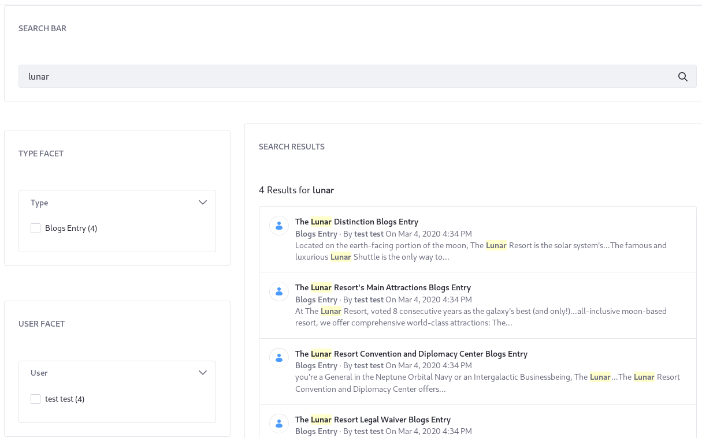
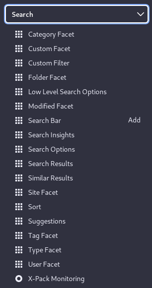
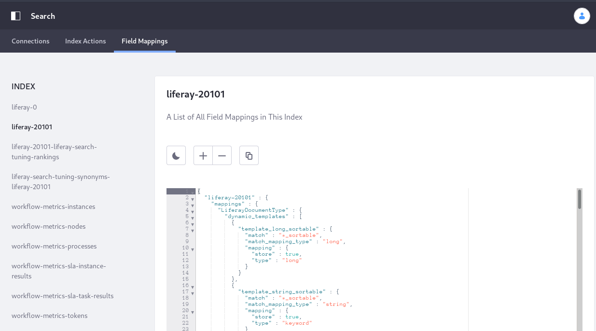

# Using Search

<!-- Using "bundled" because we're switching from an embedded elasticsearch server to a "sidecar" setup, probably by 7.3 CE GA3: https://www.oreilly.com/library/view/designing-distributed-systems/9781491983638/ch02.html -->
Liferay uses a bundled instance of Elasticsearch to power search throughout the system. Use the bundled instance for testing and development, but you must install a standalone Elasticsearch instance in production for optimal system and search performance.

Start Liferay DXP and begin exploring the out-of-the-box search functionality:

* Full-text search features
* Indexing of all content types (blogs, documents, web content, etc.)
* Highly configurable search pages
* A search bar embedded in the header of every page
* Automatic index synchronization when new content is added, updated, or deleted
* Search results filtered by roles and permissions
* Search suggestions
* Configure search results (e.g., filter and sort)
* Faceted search
* Enable or disable advanced search syntax (e.g., AND/OR/NOT, wildcards, etc.)

## Search Pages and Widgets

The search widgets that come out-of-the-box can be used to quickly build out a fully functional search page. In addition, the global search page template can be used or modified as you have need.

The default search page (`localhost:8080/search`) is based on the search page template, and contains a sensible set of search widgets, but it's also customizable:

To add search widgets to a page, click the Add button on the page, select _Widgets_, and open the Search category:

To read more about building a search page, read [here](https://help.liferay.com/hc/en-us/articles/360028821052-Configuring-Search-Pages).

To read more about the functionality of each widget, read [here](./01-user-guide/configuring-search.md).

## Search Configuration and Administration

There are several ways to configure how search works and how it indexes content. 

Many of the system scoped search configurations are located in System Settings &rarr; Search:

Additional administrative screens are located in the Control Panel &rarr; Configuration &rarr; Search section:

To read more about configuring search, read [here](./01-user-guide/configuring-search.md).

## Custom Development in Search

Custom code for search usually involves intervening in at least one of these search phases:

**Indexing** is the sending one or more documents to the search engine. The document contains fields of various types (text, keyword, etc.). The search engine processes each field and determines whether to store the field or analyze it.

**Searching** is sending a search query and obtaining results (a.k.a. hits) from the search engine. Queries and filters can be part of the search request, both of which specify a field to search within and the value to match against. The search engine iterates through each field within the nested queries and filters and may perform special analysis prior to executing the query (search time analysis). Search time analysis can be configured for each field via the mapping definitions.

The development functionality around Search can be broken into two categories: 

- Service Provider Interfaces (SPIs) are meant to be implemented. In the source code, these are found in modules ending in `-spi` (for example, the [`portal-search-spi` module](https://github.com/liferay/liferay-portal/tree/master/modules/apps/portal-search/portal-search-spi)).
Search SPIs

- APIs contain methods you can call in your own code. In the source code, these are found in modules ending in `-api` (for example, the [`portal-search-api` module](https://github.com/liferay/liferay-portal/tree/master/modules/apps/portal-search/portal-search-api)).

Further detail on the usage of these APIs and extension points  is provided in the Developer Guide.
 

<!--

Search is a fundamental component of Liferay DXP. If you're testing out the built-in search functionality or developing, there's a [search engine bundled](#elasticsearch) precisely for these purposes. Just start the portal and begin searching. In production environments, you must first install a search engine and configure Liferay DXP to begin using search.

Once a search engine holding your indexed data is freely communicating with Liferay DXP, you're ready to configure or customize the search experience.

Sites often feature lots of content split over lots of asset types. Web content articles, documents and media files, and blogs entries are just a few examples. Most content types are *assets*.Under the hood, assets use the [Asset API](https://help.liferay.com/hc/en-us/sections/360004656831-Asset-Framework) and [indexing code](#custom-development-in-search). Any content that has these features can be searched in Liferay DXP's out-of-the-box search widgets. 

## Bundled Search Features

A bunch of search widgets are bundled with Liferay DXP:

- Search Bar
- Search Results
- Search Facets
- Custom Filter
- Search Insights
- Low Level Search Options
- Similar Results (bundled in 7.3+)
- Sort
- Search Options
- Suggestions
- X-Pack Monitoring (LES)

Administrative search functionality is also included:

- Search Tuning
- Search Engine Connection Configuration
- System Level Search Configurations
- Adding and editing Search pages
- Viewing Indexes and Field Mappings
- Indexing Actions

The behavior and configuration of these features is described in the User Guide section.

## Elasticsearch

The default search engine is Elasticsearch, which is backed by the Lucene search library. There's an Elasticsearch server embedded in all bundles, which is handy for testing and development purposes. Production environments must install a separate, remote Elasticsearch server (or even better, cluster of servers).  For information on how to install Elasticsearch, read the [deployment guide](https://help.liferay.com/hc/en-us/sections/360004655831-Installing-a-Search-Engine).

Actually the rest of this stuff is probably unnecessary here. Preserving for now in a commented out section -->
<!--
## Searching

Find a search bar (there's one embedded in every page by default), enter a term, and click *Enter*.

After search is triggered, a results page appears. If there are hits to search engine documents, they appear as search results in the right hand column. In the left hand column are search facets.

The search bar, search results, and search facets make up three powerful features in the search UI.

### Search Bar

The search bar is where you enter *search terms*. Search terms are the text you send to the search engine to match against the documents in the index.

### Search Results and Relevance

The search term is processed by an algorithm in the search engine, and search results are returned to users in order of relevance. Relevance is determined by a document's *score*, generated against the search query. The higher the score, the more relevant a document is considered. The particular relevance algorithm used is dependent on [algorithms provided by the search engine (Elasticsearch by default)](https://www.elastic.co/guide/en/elasticsearch/guide/current/relevance-intro.html#relevance-intro).

### Search Facets

Facets allow users of the Search application to filter search results. Think of facets as buckets that hold similar search results. You might want to see the results in all the buckets, but after scanning the results, you might decide that the results of just one bucket better represent what you want. So what facets are included out of the box?

- Category
- Folder
- Site
- Tag
- Type
- User
- Modified
- Custom

You've probably used something similar on any number of sites. You search for an item, are presented with a list of results alongside a list of buckets you can click to further drill down into the search results, without entering additional search terms. Search facets work the same way.
-->
