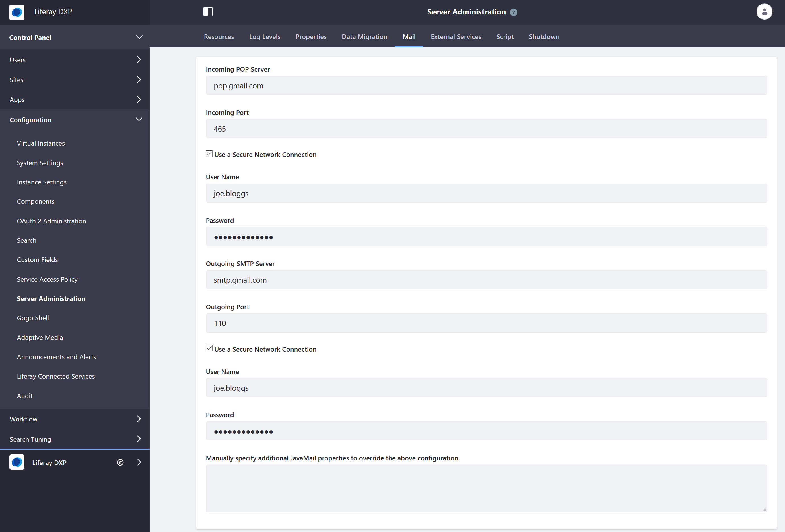

# Connecting to a Mail Server

Liferay DXP uses a mail server and SMTP to send email notifications for a variety of purposes: user registration and password management, site membership notifications, and content updates, to name a few. In order for Liferay DXP to send email notifications we recommend configuring the built-in mail session. As an alternative, you can opt to configure and use your application server's mail session.

Creating a mail session in DXP or on the application server requires the following information:

* Incoming POP Server and port
* POP User Name
* POP Password
* Outgoing SMTP Server and port
* SMTP User Name
* SMTP Password
* All optional JavaMail properties

<!-- Let's provide some information here that can help someone who DOES NOT have this information or know where to start to find this information - some helpful information or links. For example: "To learn more about this topic see: x." Maybe can we create supplemental articles to this one that say explain how to use gmail as an SMTP server to send emails from Liferay (if this actually works) something more practical. https://portaldevelopment.wordpress.com/2008/06/16/sending-email-in-liferay-portal/ , https://www.siteground.com/kb/google_free_smtp_server/ , https://docs.bitnami.com/bch/apps/drupal/configuration/configure-smtp/ for reference. -->

For more information, see [Read Gmail messages on other email clients using POP](https://support.google.com/mail/answer/7104828?hl=en) and [Check Gmail through other email platforms](https://support.google.com/mail/answer/7126229?hl=en). If using the [IMAP](https://support.google.com/mail/answer/7126229?hl=en) protocol for a category’s mailing list, make sure to [configure the IMAP inbox to delete messages](https://support.google.com/mail/answer/78892?hl=en) as they are pulled by the email client that sends messages to the users on the mailing list. Otherwise, each email message retained on the server is sent to the mailing list each time there's a new post or update in the category.

## Configuring DXP Built-in Mail Session

The built-in mail session setup can be done using either of these methods:

* Control Panel
* Portal properties

### Built-in Mail Session in the Control Panel

After deploying DXP, you can configure the mail session from the Control Panel.

1. Sign in as the administrative user (the user specified on the [Basic Configuration page](../installing-liferay/running-liferay-dxp-for-the-first-time.md)).
1. Navigate to *Control Panel &rarr; Configuration &rarr; Server Administration &rarr; Mail*.
1. Enter the following:

    * **Incoming POP Server:** (POP server hostname)
    * **Incoming Port:** (POP server port) (for example, _465_)
    * **Use a Secure Network Connection:** Flagged.
    * **User Name:** acme.org
    * **Password:** *****
    * **Outgoing SMTP Server:** (SMTP server hostname)
    * **Outgoing Port:** (SMTP server port) (for example, _115_)
    * **Use a Secure Network Connection:** Flagged
    * **User Name:** acme.org
    * **Password:** *****
    * **Manually specify additional JavaMail properties to override the above configuration:** If there are additional properties you need to specify, supply them here.

      

1. Click *Save*.

For more information, please see the [Mail Server Reference](./mail-server-configuration-reference.md).

DXP connects to the mail session immediately.

### Built-in Mail Session Portal Properties

To configure the mail session offline or before deploying DXP:

1. Create a [`portal-ext.properties` file](../reference/portal-properties.md) (if the file does not already exist).

1. Copy these default property settings into the `portal-ext.properties` file:

    ```properties
    mail.session.mail=false
    mail.session.mail.pop3.host=pop.gmail.com
    mail.session.mail.pop3.password=*******
    mail.session.mail.pop3.port=465
    mail.session.mail.pop3.user=acme.org
    mail.session.mail.smtp.auth=true
    mail.session.mail.smtp.host=smtp.gmail.com
    mail.session.mail.smtp.password=*******
    mail.session.mail.smtp.port=110
    mail.session.mail.smtp.user=acme.org
    mail.session.mail.store.protocol=pop3
    mail.session.mail.transport.protocol=smtp
    ```

1. Replace the default mail session values with your own. (See the example above.)
1. Put the `portal-ext.properties` file into the [LIFERAY_HOME](../reference/liferay-home.md).

DXP connects to the mail session on the next startup.

## Configuring a Mail Session on the Application Server

Users can opt to configure a mail session for DXP using their application server.

1. Create a mail session on your application server; please see the application server's documentation.
1. Point DXP to that mail session using the Control Panel or portal properties. <!-- What does both mean? --> Here are instructions for both:

    * Configure the JNDI name in the *Mail* page at *Control Panel &rarr; Configuration &rarr; Server Administration &rarr; Mail*. Enter the value in the _JavaMail Properties_ field. <!-- screenshot -->
    * Set a `mail.session.jndi.name` portal property in a `${LIFERAY_HOME}/portal-ext.properties` file. Here's an example property:

        ```properties
            mail.session.jndi.name=mail/MailSession
        ```

The mail server has been configured and ready to send notifications.

## Additional Information

* [Configuring a Tomcat-Managed Mail Session](../01-installing-liferay-dxp/01-installing-liferay-on-an-application-server/01-installing-liferay-on-tomcat.md#mail-configuration)
* [Mail Server Configuration Reference](./mail-server-configuration-reference.md)
* [Configuring a WebSphere-Managed Mail Session](../installing-liferay/installing-liferay-on-an-application-server/installing-liferay-on-websphere.md#mail-configuration)
